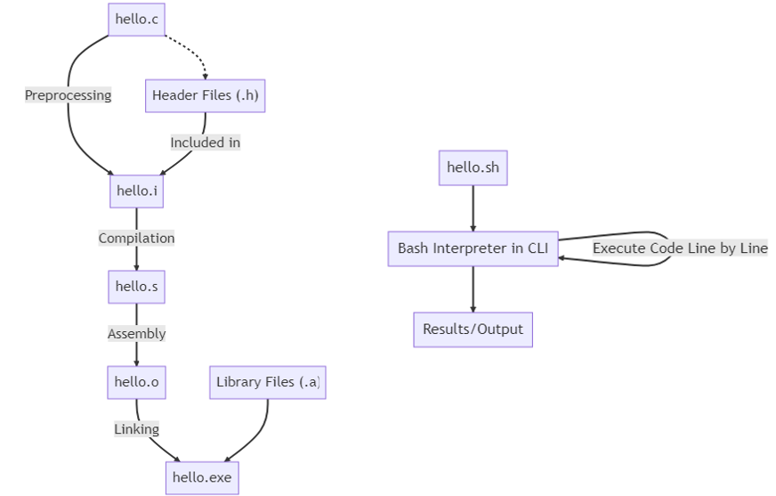
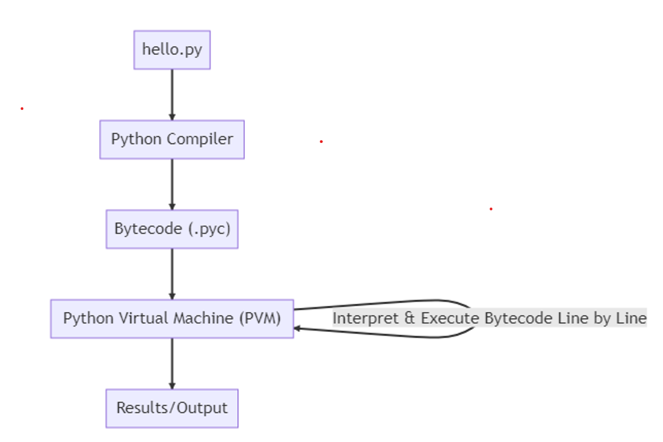

# introduction

- [introduction](#introduction)
  - [Compiler](#compiler)
    - [Advantages](#advantages)
    - [Disadvantages](#disadvantages)
  - [Interpreter](#interpreter)
    - [Advantages](#advantages-1)
    - [Disadvantages](#disadvantages-1)
  - [Compiler vs Interpreter](#compiler-vs-interpreter)
  - [Compilation and interpretation (best of both worlds)](#compilation-and-interpretation-best-of-both-worlds)

Compilers and interpreters are two different ways to execute programs.  
Compilation translates code before running it, while interpretation executes it step by step.

## Compiler

### Advantages
- Faster execution at runtime (code is translated once to machine code)
- Errors detected before execution
- Better optimization opportunities
- No need for source code at runtime

### Disadvantages
- Longer build/compile time
- Platform dependent binaries
- Less flexible for rapid prototyping
- Full recompilation needed after changes

---

## Interpreter

### Advantages
- Immediate execution (no separate compile step)
- Easier debugging (line-by-line execution)
- Highly portable across platforms
- Faster for prototyping and scripting

### Disadvantages
- Slower runtime performance
- Errors discovered only during execution
- Requires source code at runtime
- Limited optimization compared to compilers

---

## Compiler vs Interpreter

## Compilation and interpretation (best of both worlds)
> [!NOTE]
> interpreter is very slow but ASM does not run on every machine (x86_64 vs ARM)!
> solution make a vm with its own custom assembly, called Byte code

