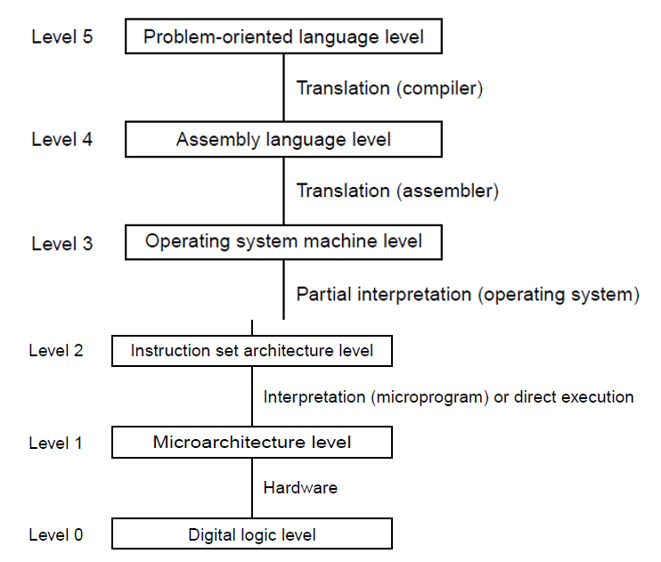

# introduction

Modern computers are built as **multilevel machines**, where each layer hides lower‑level complexity.  
This layered design makes systems easier to build, program, and understand.

## Contemporary Multilevel machines
(multiple layers of abstraction)

