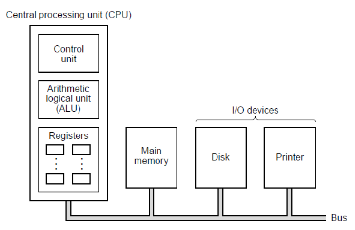

# the CPU explained

## Control Unit

**The Control Unit (CU)** is the part of the **CPU** that **directs and coordinates all operations** inside the computer.  
It tells the **processor**, **memory**, and **input/output devices** *what to do, when to do it, and how to do it.*

- **Program Counter (PC)** — holds the address of the next instruction  
- **Instruction Register (IR)** — stores the current instruction  
- **Decoder** — interprets the instruction  
- **Control Signal Generator** — issues control and timing signals  
- **Clock/Timing Unit** — synchronizes all CPU operations
