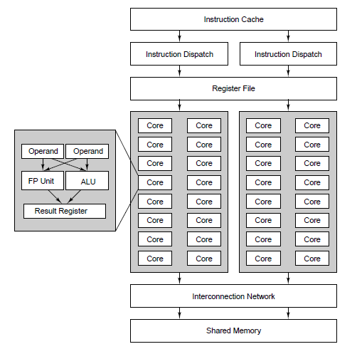

# introduction

**Data parallel computing** uses a **GPU** to perform the same operation on many data elements **simultaneously**, enabling high-performance computation for tasks like graphics and scientific processing.

## Data Parallel computing (GPU)

