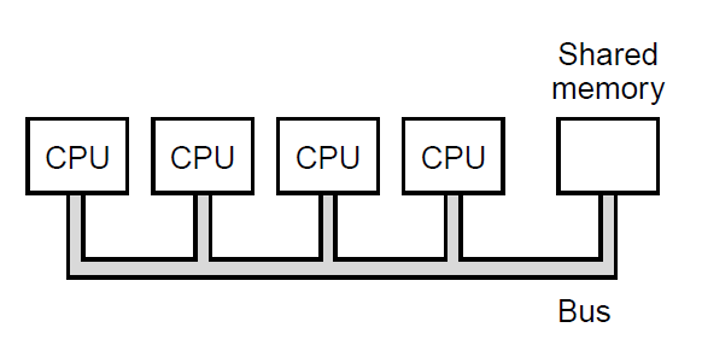
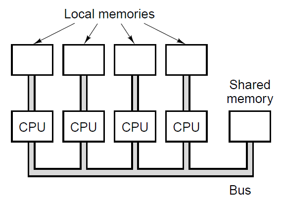

# introduction

**Multiprocessors** are computer systems that use `two` or `more` processors to execute tasks in parallel.
They improve performance, throughput, and reliability by sharing workloads across multiple processing units.

> [!WARNING]
> This is `Multi Processing` not `Multithreading`

## Topology

## Local Memory

By using `local memory` other `PROCESSORS` don't have to **wait** for the **bus** to keep working.
They can store (cache) their currently running program and not hinder the other `Processors`.

