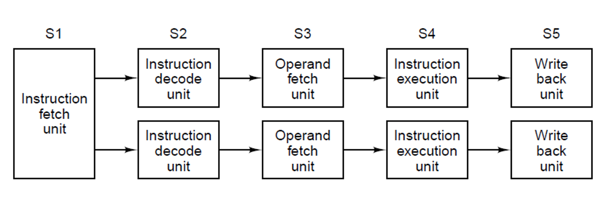
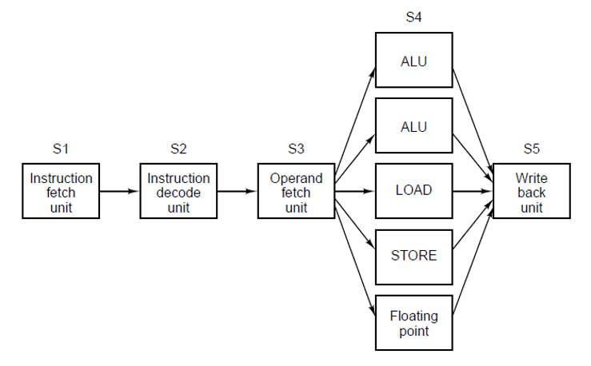

# introduction

A **superscalar CPU** can execute **multiple instructions per clock cycle** by dispatching them to **parallel functional units**, increasing throughput.

## super scalar architecture

### sequential

### Parallel Compute

