# Introduction

Memory is the General Purpose medium to store data.

## Primary Memory

The part of computer where programs and data are stored

## Bit

The bit or `Binary Digit` is the smallest data unit in the computer

## Byte Order (2)

1) little Endian
2) big Endian

### Little Endian (L -> R)

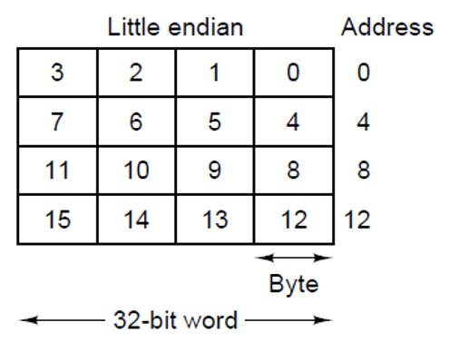

### Big Endian (R -> L)

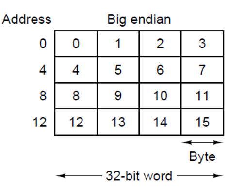

### Little Vs Big Endian

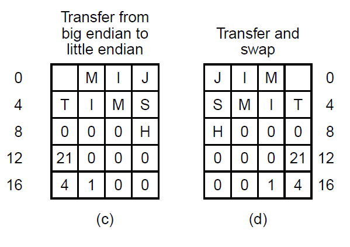

## Error Correcting Codes (ECC)

Parity checking work has 2 types:
### PARITY:
#### EVEN

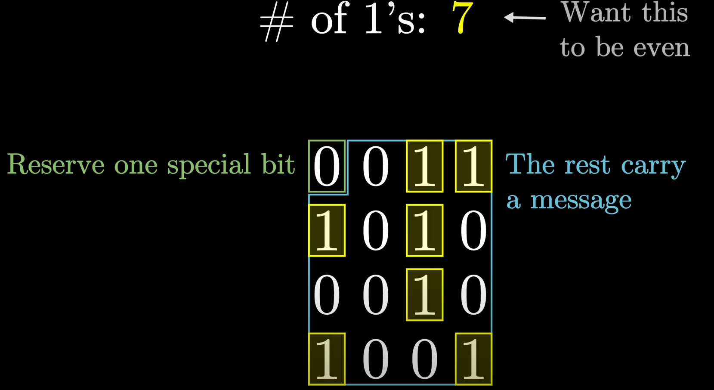

#### UNEVEN

01011011 => uneven amount of true bits => we add a 0 to make keep it an `uneven` amount: 101011011

### Hamming codes:

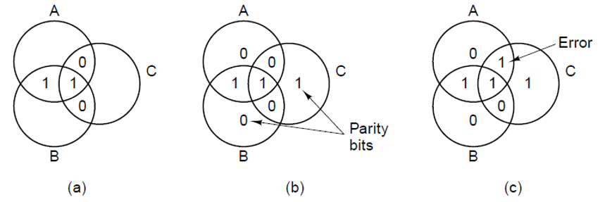

#### CHECKS (N)

the amount of checks is the same as the `number` of `parity` bits

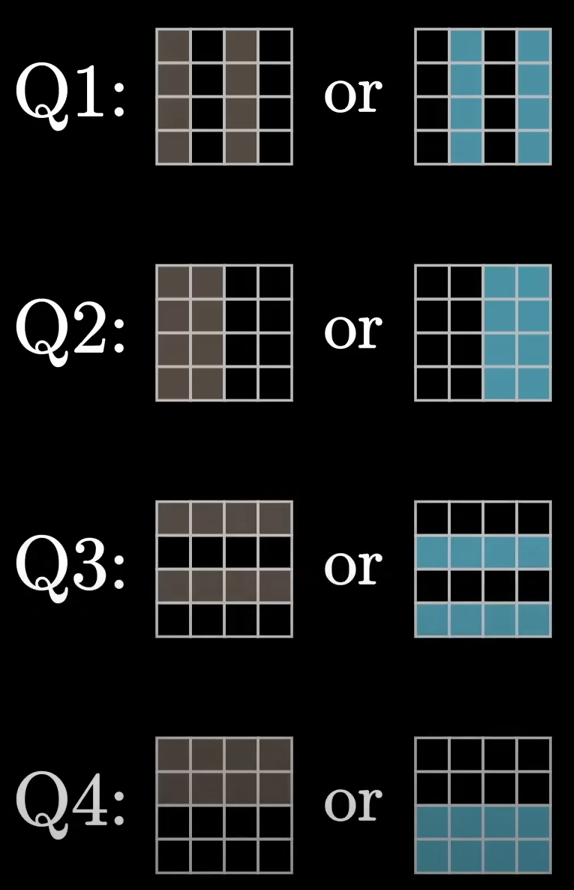

#### CHECK 1

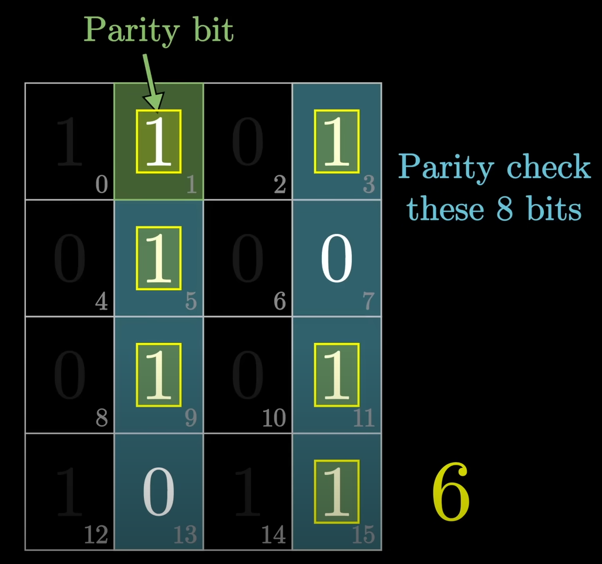

#### CHECK 2

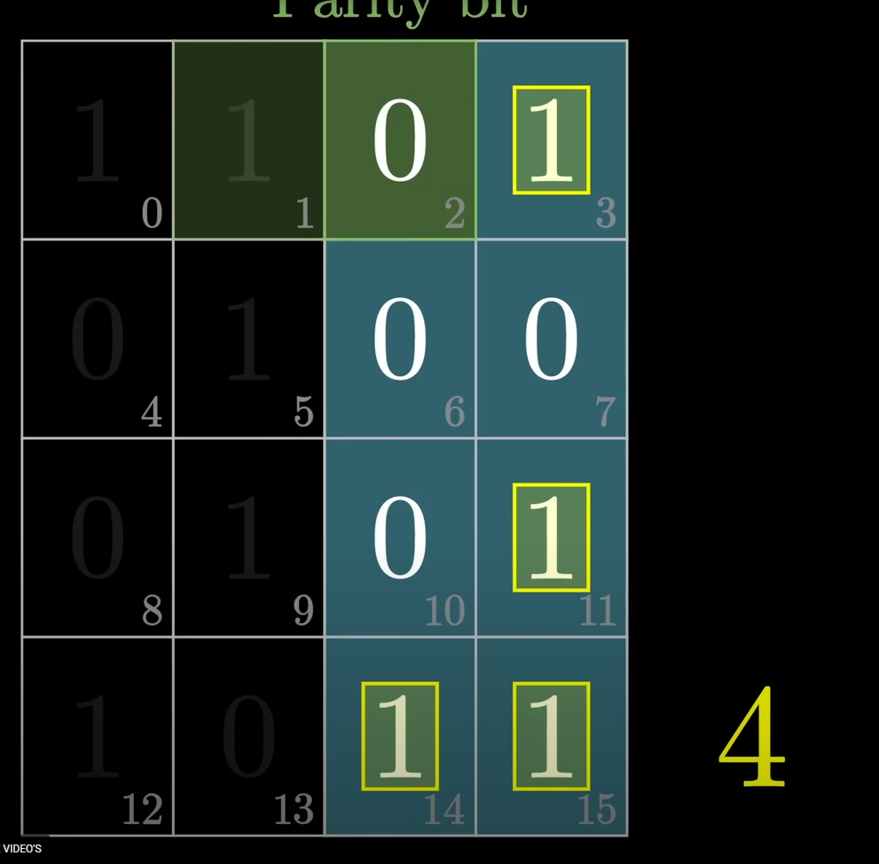

#### CHECK 3

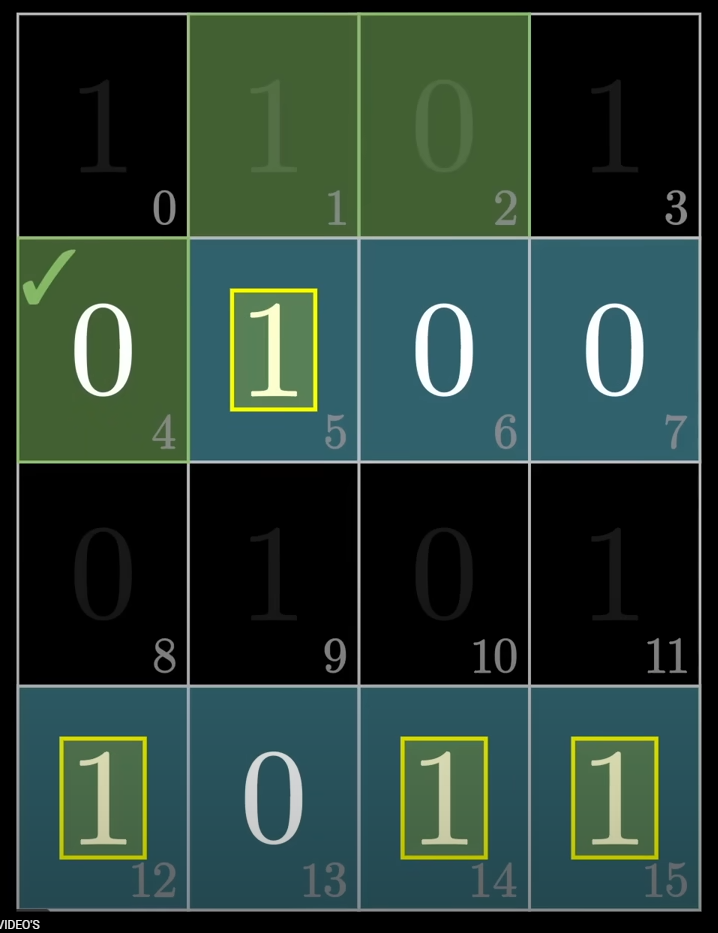

#### CHECK 4

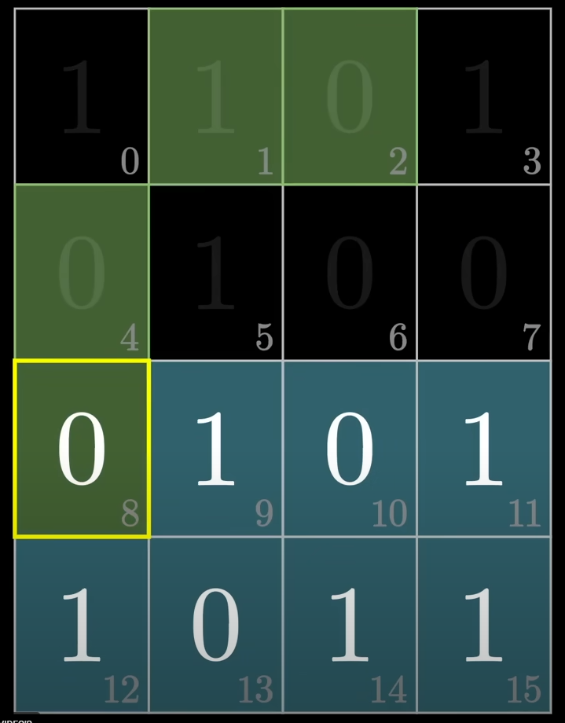

#### BLOCK CHECK

you wil note that this method does not check the `first` bit for errors.
but we can use this bit for a `parity check` of the first bit that whey we can check if there are 2 or more errors.

> [WARNING]
> there is a better version calculating the error position of this using `xor`: by xor'ing all the `true` bits binary positions the bit flip position comes out at the end

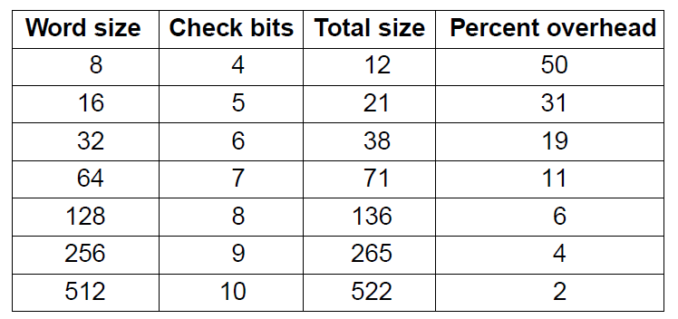

## Cache

a cache is a small and fast region of memory that in the case of hardware sits next to the CPU cores, wich makes it very fast

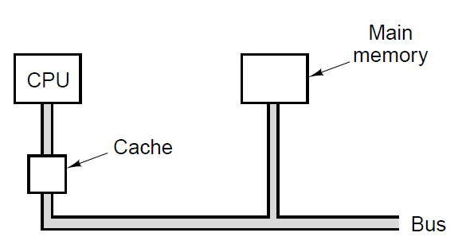
