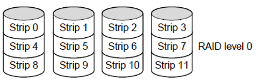
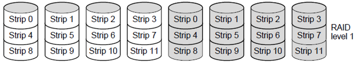
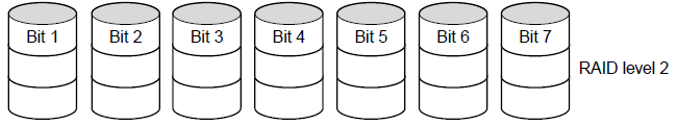
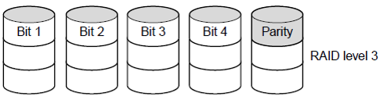
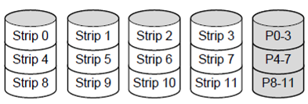

- [introduction](#introduction)
  - [RAID 0](#raid-0)
  - [RAID 1](#raid-1)
  - [RAID 2](#raid-2)
  - [RAID 3](#raid-3)
  - [RAID 4](#raid-4)

# introduction 

> `RAID (Redundant Array of Independent Disks)`: is a storage technology that combines multiple physical hard drives into a single logical unit to improve `performance`,
> `data reliability`, or `both`. 
> 
> By distributing or duplicating data across disks using different RAID levels, RAID helps protect against hardware failure and can increase read/write speeds depending on the configuration.

## RAID 0
> DATA is striped across the drives without parity
>
> 

## RAID 1

>  DATA is mirrored across the drives without parity
>
> 

## RAID 2

> DATA `BITS` are striped on the drives
>
> 

## RAID 3
> DATA `BITS` are striped on the drives with a dedicated parity drive
>
> 

## RAID 4
> DATA is `striped` across the drives with a `dedicated parity DRIVE`
>
> 