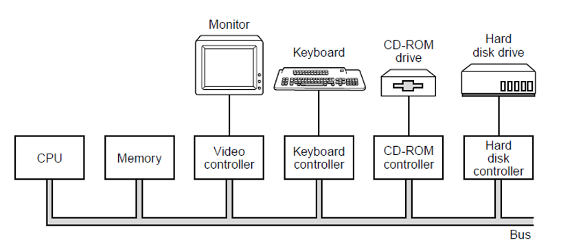
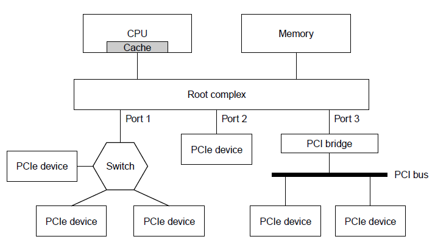

# introduction
> `Buses` are communication pathways that transfer `data, addresses, and control signals` between different components of a computer, such as the CPU, memory, and peripherals.
> 
> They enable components to `communicate efficiently` and are classified into types like `data bus`, `address bus`, and `control bus` based on the signals they carry.

## Device vs. Controller
- **Device:** The `peripheral hardware` itself (e.g., HDD, SSD, GPU, keyboard)  
- **Controller:** The `logic` that speaks the device’s protocol and exposes a `uniform interface` to the CPU/bus  

### Key Points
- **Abstraction:**  
  - Controller exposes `simple registers` (cmd/data/status) via `MMIO` or `PIO`  
  - Hides `timing` and `protocol quirks` of the device  

- **Control Flow:**  
  - `OS driver → writes controller registers → controller translates/executes → device acts`  

- **Data Path:**  
  - Controller `buffers` data  
  - Can use `DMA` for memory transfers  
  - Completion signaled by `interrupts` or `polling`  

- **Throughput:**  
  - Controllers can `queue and reorder requests` (e.g., `NCQ` in disks)  
  - Improves `latency` and `IOPS`  

- **Integration:**  
  - Often `embedded` (e.g., NVMe SSDs, SoC I/O)  
  - Logical separation remains  
  - Controller handles `retries`, `status`, and `errors`  

- **Examples:**  
  - GPU/video, HDD/SSD ↔ SATA/NVMe, keyboard ↔ USB/HID  

---

## Driver and Controller Interaction

### 1. Driver Prepares the Command
- OS driver sets:
  - `address`
  - `length`
  - `opcode`  

### 2. Fill Controller Registers
- CPU writes via `MMIO`/`PIO` to:
  - `command register`
  - `data/address register`
  - `length register`
  - `start/doorbell register`  

### 3. Controller to Device
- Controller translates the command into the device’s protocol:
  - Examples: `SATA`, `NVMe`, `USB`, `HID`  
- Kicks off the operation  

### 4. Data Path
- **PIO Reads:** Device places data in the `controller buffer`, CPU reads it  
- **PIO Writes:** CPU stores data into the `controller buffer`  

### 5. Completion
- Controller updates `status/flags`  
- CPU:
  - Polls `status register` **or**
  - Receives an `interrupt` (`INTx` or `MSI/MSI-X`)  
- CPU reads `status/error codes`  

### 6. Driver Finalizes
- Clears `status`  
- Copies data if needed  
- Wakes waiting threads  
- Returns result to the caller

## Inconsistent View of Data with Write-Back Caches

- **Problem:**  
  - CPU may keep recent updates in `L1/L2 cache` without immediately writing them to RAM  
  - DMA devices read/write directly to RAM  

- **Effect:**  
  - Device may see `stale data` if CPU hasn’t written its updates  
  - CPU may see `stale data` if device has written to RAM but cache wasn’t updated  

- **Result:**  
  - CPU and device can have an `inconsistent view` of the same memory

## PCI-LOCAL

### PCI Overview

- **Definition:**  
  - `Legacy parallel, shared I/O bus standard` (PCI Local Bus)  
  - Attaches `controllers` (NIC, GPU, SCSI) to `CPU/memory` via a `PCI bridge`  

- **Topology:**  
  - Multiple devices share a single bus  
  - `Central arbiter` grants bus access  
  - `Bridges` connect bus segments to memory  

- **Transactions:**  
  - `Memory-mapped` or `I/O-mapped` reads/writes  
  - Devices support `bus mastering DMA` to move data without CPU intervention  

- **Configuration Space:**  
  - Each device has a standardized `Configuration Space`  
  - Includes `Vendor/Device IDs` and `BARs (Base Address Registers)`  
  - BARs map device registers into `system address space`  
  - OS enumerates devices at boot (`Plug-and-Play`)  

- **Interrupts:**  
  - Legacy `INTx#` (shared, level-triggered)  
  - Optional `MSI/MSI-X` on later PCI/PCI-X  

- **Speeds (theoretical):**  
  - `32-bit @ 33 MHz ≈ 133 MB/s`  
  - `64-bit @ 66 MHz ≈ 533 MB/s`  
  - `PCI-X up to 1.06 GB/s`  
  - Real throughput lower due to `arbitration/turnaround`  

---

### Shift from Parallel to Serial Buses

- **Reason for shift:**  
  - Parallel buses hit limits at high speeds:  
    - `Inter-wire skew`  
    - `Crosstalk`  
    - `Reflections`  
    - `Tight timing margins`  
    - Increasing `pin/trace count`  

- **Advantages of Serial Links:**  
  - Use `differential pairs + SERDES`  
  - Higher `bit rate per pin`  
  - Cleaner `signal integrity`  
  - Simpler `routing/connectors`  
  - Better `EMI behavior`  

---

### Skew

- **Definition:**  
  - `Difference in arrival time` of signals launched simultaneously on different wires  
  - Small `length` or `impedance mismatches` shift edges  
  - Misalignment causes `bit errors` when sampling  

---

### How Serial Links Mitigate Skew

- One `differential data path per direction` → no inter-lane skew  
- Clock is `recovered from data` (`Clock and Data Recovery`)  
- `Link training` and `equalization` compensate for channel loss and dispersion  
- Use of `line codes` (e.g., `8b/10b`, `128b/130b`) ensures:  
  - `Transition density`  
  - `Bounded wander`

## PCI-EXPRESS

### PCIe Overview

#### **Definition:**  
  - `High-speed serial`, `point-to-point` interconnect  
  - Each link consists of `1 or more lanes` (`x1`, `x4`, `x8`, `x16`)  
  - Full-duplex communication  

#### **Topology:**  
  - `Root Complex (RC)` → `ports` → `Endpoints (EPs)` and `switches`  
  - Each hop is `isolated` (no shared bus)  

#### **Speeds per Lane (approx. payload each way):**  
  - `Gen1 2.5 GT/s ≈ 250 MB/s`  
  - `Gen2 5.0 GT/s ≈ 500 MB/s`  
  - `Gen3 8.0 GT/s ≈ 985 MB/s`  
  - `Gen4 16 GT/s ≈ 1.97 GB/s`  
  - `Gen5 32 GT/s ≈ 3.94 GB/s`  
  - `Gen6 64 GT/s (PAM4+FEC) ≈ 7.88 GB/s`  

#### **Protocol Layers:**  
  - `PHY`  
  - `DLL` (Data Link Layer: DLLPs, CRC, replay)  
  - `TL` (Transaction Layer: TLPs for Mem/IO/Cfg/Msg)  
  - `Credit-based flow control`  

#### **Addressing & Configuration:**  
  - Retains `PCI model`  
  - `Config Space`, `Vendor/Device IDs`, `BARs` (MMIO)  
  - OS enumeration occurs at boot/plug  

#### **Interrupts & DMA:**  
  - Uses `MSI/MSI-X` standard  

#### **Features:**  
  - `Hot-plug`  
  - `AER (Advanced Error Reporting)`  
  - Other modern capabilities  

#### **Advantages over PCI:**  
  - `Dedicated bandwidth` per device  
  - `Scalable lanes` for higher throughput  
  - Fewer `contention/turnaround penalties`  
  - Improved `power management` and `error handling`
